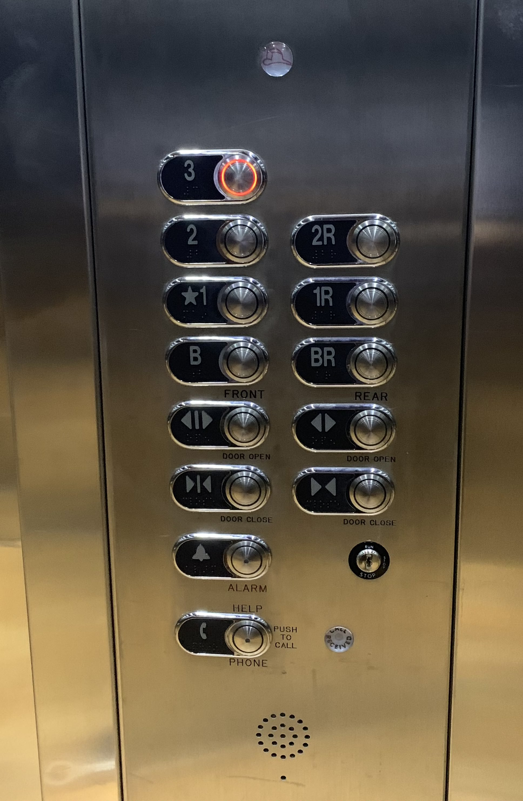

# Elevator_Homework

For my homework I decided to use the elevator in the Student Union Building next to Barnes and Noble.

With this elevator one of the issues I noticed was why were there two different rows with the same number except one had an extra R next to it. You can see that one says front and the other says rear, but what does that mean? Once you figure it out how do you know if the side you are looking at is the front or the rear? Another issue is that the one without the R has a star next to it and we can assume that it is the ground floor but couldn't the button with the B be the ground floor and what floor does B take you to? Last thing I noticed is that for each floor it does not have some type of directory, so how would someone who does not go to this school know exactly what is on the floor. 

One of the more common uses for elevators is to get you up and down different floors but what else can they be used for? In some of my previous jobs the elevators were used to transport heavy fixtures or different variety of things up and down floors. With this interface it wouldn't be that hard to transport people or things up and down the elevator but you would just have to understand which side you're on and which side you are going. 

For this elevator it is not to hard to try and figure out how to use but the only issue is to figure out which side you are on. Once the user figures out how to use it they can push the button and the button will light up to let them know which floor they are going to, which is a great design feature because it can give the user ease of mind knowing that they are going to the correct floor. The only thing about this interface design is if this was in a store or different setting besides a school, how would the user know what the floor holds.
